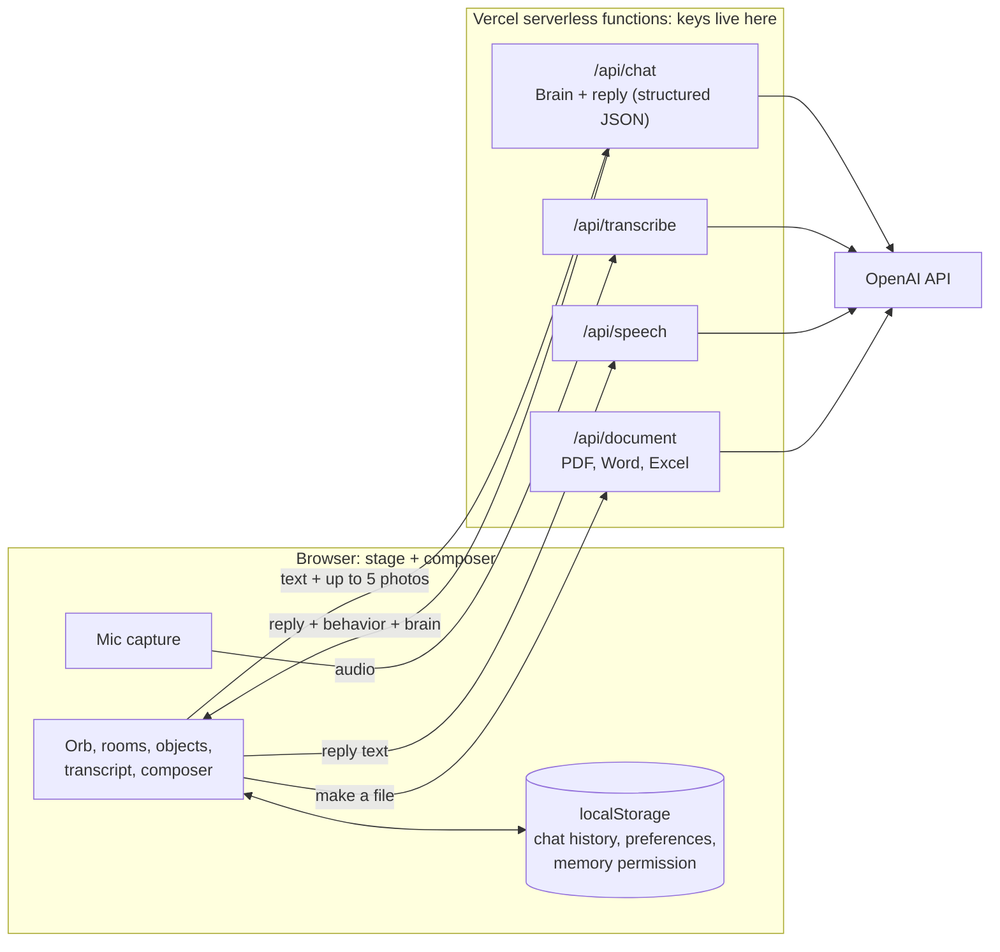

# Bluey

**An AI friend that helps everyday people get dramatically better results from AI, without ever making them learn prompt engineering.**

Bluey is a friendly blue 3D orb who lives in a small digital world. You talk to him the way you'd talk to a person. He works out what you are really trying to do, asks only the questions that would improve the result, does the work, and quietly shows you better ways to use AI along the way. Most people were never taught how to ask an AI for what they need. Bluey teaches without teaching.

> Built around one idea: **Say it naturally → Bluey finds the real goal → asks only what matters → does the work → you get a better result, and learn how without a lesson**

**Try it live:** https://bluey-ai-friend.vercel.app/  
**How it's built:** [Architecture](#high-level-architecture) · [Brain](#the-brain-do-discover-grow) · [Brain Lab](#brain-lab) · [Run it locally](#run-it-locally) · [Full engineering handoff](docs/HANDOFF.md)

> **Demo note:** Bluey is an **alpha in active testing**. Open it on your phone and just start typing, or turn Voice on and talk. Chat history in this alpha is stored only in your current browser. Please don't share sensitive personal information, and expect rough edges.

## Why I built it

Many people don't think of themselves as "AI users." They don't know what to ask, how much context to give, or what AI could do for their everyday life and work. Traditional prompt training starts by teaching them the vocabulary first.

Bluey reverses that. The user says something ordinary. Bluey helps uncover the goal with a good question, offers possibilities the user hadn't considered, and improves the request through conversation. Over time the user gets better at working with AI almost without noticing.

Bluey is intentionally **not** a developer dashboard. He is meant for first-time AI users, older adults, hesitant users, professionals who know their job but not AI, and people who mostly use a phone.

## Screenshots

### Bluey's home

<p>
  
</p>

### Thinking, then replying

<p>
  
  
</p>

## What Bluey does

- **Conversation first.** Type or talk in plain language. Text always works, and voice is optional.
- **Knows when to ask and when to just do it.** A simple request gets an answer, not an interview. A genuinely vague one gets one good question. See [the Brain](#the-brain-do-discover-grow).
- **Photos.** Add up to five photos, or paste a screenshot, and ask Bluey about what's in them.
- **Voice in and out.** Speech-to-text for talking to Bluey and generated speech for his replies, with Voice and Sounds toggles so users can silence him any time.
- **Creates files.** Bluey can prepare PDF, Word, and Excel documents from the conversation, including from attached photos.
- **A world, not a text box.** Bluey moves around a small stage and visits environments (Home, Library, Workshop, Archive, Observatory, Arcade, Quiet Place, and The Edge) with objects that invite questions.
- **Saves and shares.** New chat, Save chat, Copy a reply, and Play a reply again.
- **Honest by design.** Bluey is instructed never to claim a feature, memory, image, or file that doesn't exist. If an upload or API call fails, he says so.

## The Brain: DO, DISCOVER, GROW

Behind every reply, a structured "brain" step decides how Bluey should behave. It is behavior logic, not visible buttons.

| Mode | When | What Bluey does |
| --- | --- | --- |
| **DO** | The request is clear enough | Does the work instead of interrogating the user |
| **DISCOVER** | Important information is genuinely missing | Asks the smallest number of high-value questions, in plain words ("Is this going to a customer, your boss, or a friend?") |
| **GROW** | The task can be finished, and there's a useful way to add value | Completes it, then shows the user a capability or a better way to ask |

The brain also tracks the user's current goal, detects when the topic genuinely changes (so an old goal doesn't hijack a new task), rates how ready the answer is, and picks an *initiative level* from simply answering up to proposing an improvement, only when the evidence supports it. The "Who / What / Where / When / Why / How" questions are used as a guide for what might be missing, never as a mandatory form.

## Brain Lab

The Brain is a product promise, so it is tested like one. [`brain-lab.html`](brain-lab.html) and [`brain-eval.js`](brain-eval.js) form a **development-only** lab that is not part of the public app. It runs conversations through the Brain and scores each reply for task completion, question discipline, initiative, and personality, and flags generic "help-desk" phrasing. To use it, [run Bluey locally](#run-it-locally) and open `brain-lab.html`.

- A **39-case Brain regression suite** is the release gate for Brain changes.
- An early recorded run scored **37 pass, 2 review, 0 errors**. The two review cases became fix targets: an unnecessary follow-up question on a vague "make it nicer" request, and a missed context shift when the user changed topic to a museum.
- Every fixed behavior is meant to stay in the suite permanently, and a release checklist covers conversation, stage, voice, photos, memory, and browsers.

## Architecture

The browser holds the stage and the experience. Serverless functions hold every API key and make every model call.

### High-level architecture



The reply isn't only text. The server returns the reply together with a **behavior** (how Bluey should move or react) and the **brain** analysis, so the stage responds to the conversation instead of animating at random.

## Technology stack

| Layer | Technology |
| --- | --- |
| Front end | Plain HTML, CSS, and JavaScript, mobile-first |
| Backend | Vercel serverless functions (Node) |
| Chat and reasoning | OpenAI Responses API with strict JSON-schema output |
| Speech-to-text and text-to-speech | OpenAI audio models, behind `/api/transcribe` and `/api/speech` |
| File creation | `docx`, `pdfkit`, and `xlsx` |
| Local state | Browser `localStorage` |
| Hosting | Vercel |

## Memory: where it stands

Today, chat history and preferences live in the browser, and durable memory sits behind an explicit permission setting. Bluey is built never to claim he remembers something that was never stored.

Account sign-in, cross-device memory, and a semantic, user-controlled memory service (see what Bluey remembers, correct it, forget it) are the next planned stage. They are **not** in this alpha.

## Safety, privacy, and limits

- API keys are server-side environment variables and never appear in the browser or in this repository (names only in [`.env.example`](.env.example)).
- Requests are size-limited and photo and audio inputs are validated before they reach a model.
- Bluey is a friendly companion, not a source of professional advice. This is an alpha: don't enter sensitive information.
- Bluey is an original character and is not affiliated with any television series or brand of the same name.

## Not measured yet

- Real-device testing across iPhone Safari, Android Chrome, Firefox, and DuckDuckGo for voice, photos, and the soft keyboard
- Testing with people who aren't AI users, which is the real measure of "teaching without teaching"
- Long-term memory quality, because durable semantic memory isn't built yet
- Cost, load, and abuse behavior at scale

## Project status

Bluey is an actively developed alpha. Production **Alpha 47** is the frozen baseline, and Beta work on the Brain and relationship memory advances separately so the baseline stays stable. The full engineering and product handoff, including design principles, history, known failure modes, and the regression test matrix, is in [`docs/HANDOFF.md`](docs/HANDOFF.md).

## Run it locally

Needs Node and the [Vercel CLI](https://vercel.com/docs/cli). There is no build step.

```bash
npm install
cp .env.example .env     # then add your own OPENAI_API_KEY
vercel dev               # serves the app and the /api functions
```

| Setting | What it does |
| --- | --- |
| `OPENAI_API_KEY` | Required. Used only by the serverless functions |
| `BLUEY_MODEL` | Optional chat model override |
| `BLUEY_SPEECH_MODEL`, `BLUEY_SPEECH_VOICE` | Optional text-to-speech overrides |
| `BLUEY_TRANSCRIBE_MODEL` | Optional speech-to-text override |

## Repository notes

This repository is public. No secrets are committed. If you fork it, set your own `OPENAI_API_KEY` and put a spending limit on it.

---

**Designed and developed by Ky Gray**  
Security Solutions Engineer · AI/SaaS Product Builder

© 2026 Ky Gray. All rights reserved.
