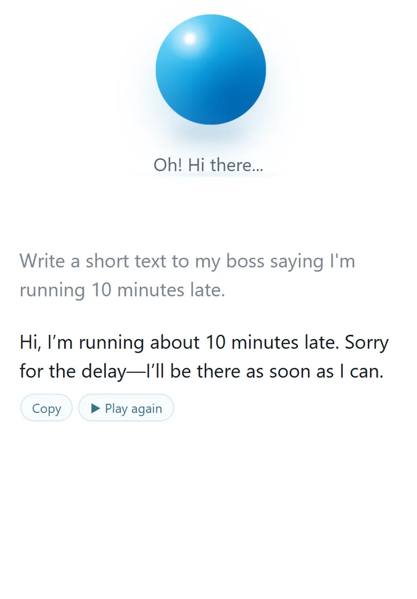
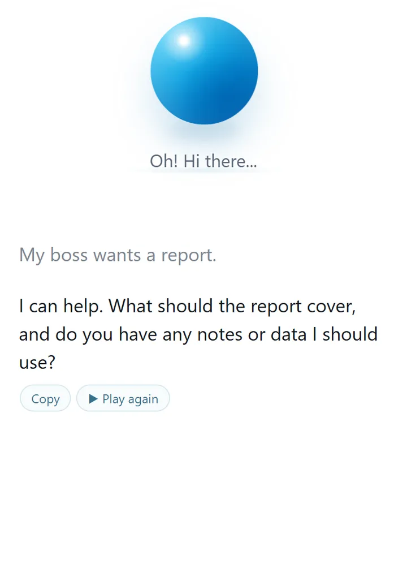
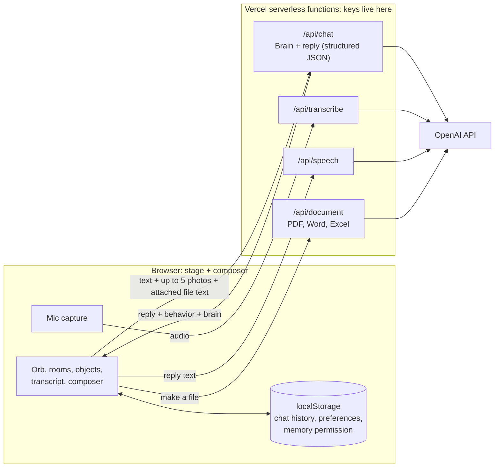

# Bluey

**An AI friend that helps everyday people get dramatically better results from AI, without ever making them learn prompt engineering.**

Bluey is a friendly blue 3D orb who lives in a small digital world. You talk to him the way you'd talk to a person. He works out what you are really trying to do, asks only the questions that would improve the result, does the work, and quietly shows you better ways to use AI along the way. Most people were never taught how to ask an AI for what they need. Bluey teaches without teaching.

> Built around one idea: **Say it naturally → Bluey finds the real goal → asks only what matters → does the work → you get a better result, and learn how without a lesson**

**Try it live:** https://bluey-ai-friend.vercel.app/  
**How it's built:** [Architecture](#high-level-architecture) · [Brain](#the-brain-do-discover-grow) · [Brain Lab](#brain-lab) · [Run it locally](#run-it-locally)

> **Demo note:** Bluey is an **alpha in active testing**. Open it on your phone and just start typing, or turn Voice on and talk. Chat history in this alpha is stored only in your current browser. Please don't share sensitive personal information, and expect rough edges.

## Why I built it

Many people don't think of themselves as "AI users." They don't know what to ask, how much context to give, or what AI could do for their everyday life and work. Traditional prompt training starts by teaching them the vocabulary first.

Bluey reverses that. The user says something ordinary. Bluey helps uncover the goal with a good question, offers possibilities the user hadn't considered, and improves the request through conversation. Over time the user gets better at working with AI almost without noticing.

Bluey is intentionally **not** a developer dashboard. He is meant for first-time AI users, older adults, hesitant users, professionals who know their job but not AI, and people who mostly use a phone.

## Screenshots

A clear request gets done (DO). A vague one gets one question first (DISCOVER).

<p>
  
  
</p>

## What Bluey does

- **Conversation first.** Type or talk in plain language. Text always works, and voice is optional.
- **Knows when to ask and when to just do it.** A simple request gets an answer, not an interview. A genuinely vague one gets one good question. See [the Brain](#the-brain-do-discover-grow).
- **One blue + button.** A round blue **+** at the left of the message box opens a single menu: **Add photos & files**, **Take a photo** (phones only, opens the camera), the **Voice** and **Sounds** switches, and **Remembered**. Everything except New chat lives there, so the screen stays clean and new controls have a home. When Voice is off, the + shows a small 🔇 badge.
- **Reads your files, all the way through.** Add a PDF, Word (.docx), text, or CSV file (or drag one onto the page) and ask about it, the way you would in ChatGPT or Claude. The file is read right in the browser (PDF with pdf.js, Word with mammoth) and only its text is sent. The whole document goes with every message while it's attached, so follow-up questions still see it, and Bluey is told it's the complete text from start to end. That fixed a real problem: given a pasted résumé, he once said it "cuts off" where it simply ended. A chip shows each file's name, pages, and word count, with × to remove it. A scanned PDF (pictures, no text) is read as photos of its pages. Files over about 100 pages of text are refused with a plain message instead of being cut silently, and older .doc files get "Save As .docx or PDF" advice. Attached files last for the browser tab, until you remove them or start a New chat.
- **Add Bluey to your home screen.** Bluey is a PWA: install him on a phone or computer and he opens from his own icon, a round blue ball rendered from the same CSS as the orb on screen, in his own window. The blue + menu offers **Add Bluey to your home screen**: Chrome gets its real install dialog. iPhones never offer one, so everything else gets a step-by-step guide with pictures of the real buttons, matched to the browser: on an iPhone in Safari, tap ⋯ next to the address bar, then Share, Add to Home Screen, keep Open as Web App on, and Add (Chrome, Firefox, and Edge on iPhone, in-app browsers like Instagram, and Android browsers each get their own steps). On iPhones, a one-time "Make Bluey an app" card appears from the second visit. A small service worker keeps a copy of the app so it opens with no signal (and says "No signal right now"); chat, speech, and files always go to the network and are never cached.
- **Long pastes become attachments.** Paste more than 4,000 characters and it turns into a "Pasted text" chip, like Claude does, so Bluey knows he has all of it.
- **Formatted answers.** Longer answers (a review, a plan, steps, a packing list, a comparison) come back with headings, bullet points, numbered steps, bold, and simple tables, like ChatGPT and Claude. Casual chat stays plain, and a message you'll send (a text, an email, a toast) stays plain text. Copy keeps the formatting when pasted into Word or an email and gives clean text everywhere else, and Bluey's voice never reads the symbols aloud.
- **Photos.** Add up to five photos, take one with the phone camera, or paste a screenshot, and ask Bluey about what's in them.
- **Voice in and out.** Speech-to-text for talking to Bluey and generated speech for his replies, with Voice and Sounds switches in the blue + menu, so users can silence him any time. His voice is male, with a warm, gentle Irish accent (OpenAI's Echo voice), picked by ear from seven samples; when generated speech can't load, the phone's own voice is chosen to match (an Irish or British male voice where the device has one).
- **Creates files.** Bluey can prepare PDF, Word, and Excel documents from the conversation, including from attached photos and files.
- **A world, not a text box.** Bluey moves around a small stage and visits environments (Home, Library, Workshop, Archive, Observatory, Arcade, Quiet Place, and The Edge) with objects that invite questions.
- **Steer a draft with one tap.** Under a draft Bluey writes (a text, an email, a post, a plan) sit small buttons: **Shorter, Warmer, More specific, Different angle**, and a **More ▾** dropdown with More formal, More casual, Simpler words, Bullet points, For someone else…, and Something else…. Tapping one sends a plain message like "Make it shorter." in your own chat, so you see that a few ordinary words steer the result, and Bluey edits his draft instead of starting over, keeping every detail. Small talk and answers don't get the buttons.
- **Knows where the big jobs belong (the hand-off kit).** Some things Bluey can't do here: build and run an app, website, or dashboard; generate a logo, image, or video; run something every Monday; or study a stack of your own documents with citations. Instead of pretending, he tells you the best place to do it and why (Claude · Claude Code, ChatGPT · Codex, Canvas, Tasks, or Image generation, Gemini · Video generation or Gems, NotebookLM…), names a second good option, and writes a complete **super prompt** for it: goal, audience, your details, requirements, the exact output, an approach, and how to check the result, with [blanks] only for what only you know. A card under his reply has **Copy prompt**, **Open** (copies it and opens the platform; ChatGPT and Claude get it pre-filled when it's short enough), and **Download PDF** (the recommendation, the prompt, and how to use it, made from the exact text). The card also shows **🧭 How to set it up**: 3–7 beginner steps Bluey writes from the platforms' **official help sites**, which he searches and nothing else (support.claude.com, docs.claude.com, claude.com/docs, help.openai.com, platform.openai.com/docs, developers.openai.com, support.google.com/gemini, ai.google.dev/gemini-api/docs, cloud.google.com/vertex-ai/docs, support.google.com/notebooklm), with those pages linked as **Official help**. For example, a weekly news summary links to "Scheduled tasks in ChatGPT". Feature names come from a fixed list the server checks, because product names change and an AI can confidently invent one. Simple jobs (a note, a grocery list, a party plan) stay with Bluey.
- **Looks things up, with sources.** When an answer depends on current facts (job openings, prices, hours, news, a specific company), Bluey searches the web and lists the pages he used under his reply, as tappable links. When you ask him to *find* something (jobs, products, places), he leads with what he found, makes his best guess when the request is vague ("I'm treating this as a customer-facing technical role"), and then asks at most one question. He doesn't search for writing help or general questions. The server keeps only links the search really returned, so he can't make up a source. Searching takes longer (often 20–40 seconds), so after a few seconds the status changes to "Still working on it… looking things up can take a moment." Searches have their own daily limit per visitor; when it's reached, Bluey says he can't check live information right now. Each source shows the page's own preview picture (the one a link preview uses) as a small thumbnail, read from the pages Bluey actually used, never during a scam check.
- **Shows you pictures.** Ask what something looks like ("show me a blue morpho butterfly", "what does Neptune look like?") and a few openly licensed photos from Wikipedia appear under the answer, each with the photographer's credit and license and a link to its Wikimedia page. Bluey names the subject; the server finds the best-matching article and keeps only photos of that subject (so "Neptune" shows Neptune, not portraits of the astronomers who found it), skipping drawings, maps, logos, and anything whose categories suggest unsafe content. No pictures for private people, anything sexual, violent, or medical, products, or news, and Bluey never describes a photo he hasn't seen.
- **💡 Tap your answers.** When a clearer request would give a much better result, Bluey shows a stronger version of *your* request, with the added parts highlighted. Each missing detail gets a few likely answers to tap (for an instruction manual: *assembling furniture · using an appliance · setting up software · Other…*), or a text box for things only you know, like a shared memory. The sentence fills in as you tap, so you see what a good request looks like, and **Write it** sends it once everything's filled. When Bluey is asking you for details, the card appears right under his question, so he never asks twice. Once you tap **Write it**, he writes the result instead of asking a follow-up question. Anything still missing gets a sensible assumption, shown in the 💭 line ("I assumed a standard drip coffee maker"). When he's already written something, a small 💡 under your message opens the same card. It works with one thumb on a phone. Clear requests, small talk, and follow-ups get no card. It replaces the older "Build prompt" button.
- **Says what he guessed.** When a draft rests on a guess (who it's for, the tone), a quiet line under it says so and invites a correction: "💭 I kept it warm and general, as if you're a guest giving the toast. If that's not right, just tell me." (It used to have a "Fix that" button, but the button wasn't clear on its own, so the line now just asks.)
- **Spell check like Notepad.** The chat box uses the browser's own spell checker: misspelled words get a red squiggle, and right-clicking offers fixes (on phones, the keyboard does this). Bluey's old "Small spelling suggestion" card is switched off.
- **Small first versions for big tasks.** Ask for a plan or a bigger project and Bluey gives you a short first version right away, then offers to build it out, instead of asking for a perfect brief.
- **Remembers you on this device, no sign-up.** Tell Bluey your name, your work, a project, or a goal, and he keeps it on your device and uses it naturally later ("Hi Jason!", a LinkedIn headline that knows you're job hunting). Each new memory shows a small note, "💾 I'll remember: your name is Jason.", with Undo, and **What Bluey remembers** in the blue + menu lists everything (facts and saved answer preferences), each with Forget, plus a two-tap Forget everything. He never keeps sensitive things like passwords, ID or card numbers, health details, or exact addresses (the server double-checks), never saves lines from practice talks or scam checks, and never claims to remember something he doesn't have. Memory stays on that one device unless the person chooses to sign in.
- **Optional sign-in (built; switching on after setup).** Continue with Google, Continue with Apple, or an email link (with a 6-digit code for the iPhone home-screen app). On sign-in, what the device remembers and the saved preferences move into the account, and every later change is copied there, so Bluey knows you on your phone and your computer. Supabase Auth with row level security: each person can only read or change their own rows. Sign out removes the memories from that device (they stay in the account), and Delete my account (two taps) removes everything. Guests never need an account: signed out, Bluey works exactly the same. Setup steps: [`docs/sign-in-setup.md`](docs/sign-in-setup.md).
- **Remembers what you choose, in this browser.** Say something lasting ("from now on, keep it short") and Bluey asks "Remember this for next time?". Nothing is saved unless you tap Remember. A **Remembered ▾** list in the blue + menu shows what's saved, with Forget and Forget all. Up to 8 preferences, kept only in this browser, sent with each message as style preferences.
- **A fun hello.** About 30 greetings in Bluey's voice (marbles, Pixel One, suspicious magnets), a few for Mondays, Fridays, and weekends, and a few for his July 4th Digital Day. It won't repeat any of your last 8.
- **Keeps it simple.** The blue + menu, New chat, Copy a reply, and Play a reply again. (Save chat is hidden for now; its code is still in the app.)
- **A whole storybook life to discover.** Bluey has a history you can explore by just asking: his **Digital Day** (July 4th, the night a stray blue spark from a fireworks video lit up a lonely pixel), how the builder agent **K.Y.** named him with a B.L.U.E.Y. sticky note that same night, the chapters of his life (the Pixel Days, Library Apprentice, the Workshop Years, **the Great Printer Incident**, the Edge Expedition), his friends (Pixel One, who blinks twice for yes; **Fib**, a cheerful autocomplete who's confidently wrong; Echo, Shelvy, Captcha the cat, Ping, the 404 Ghost, Dot the cursor), hobbies (404 tourism, haiku for error messages, rating loading spinners), philosophies ("A guess said out loud is better than a guess hidden"), and Easter eggs. Interview him, ask him on a pretend date, or ask **"What are you doing?"** and he'll answer with a little scene that carries one real lesson about AI (hallucinations, vague prompts, agents, checking sources), without a lecture. Each friend stands for something real about how AI works. He's honest that it's his storybook life as an AI made by Ky Gray. The lore lives in [`api/_lore.js`](api/_lore.js), and only the chapters that fit a question are sent with it, so ordinary requests stay fast and free of it. If you sincerely ask who built the app, he tells the truth: Ky Gray, "which might explain K.Y."
- **He knows his creator, honestly.** Bluey can't see who's typing, so "I'm your creator" from anyone gets a warm, playful reply that never confirms it ("If it's really K.Y., hi! I can't see who's typing..."). Ky opens a private link once per device (or types the code into the message box, for the iPhone Home Screen app, which keeps its own storage; that message is caught on the device and never sent); the code is checked against a server-side secret, and only then does Bluey greet him as the person who built him ("You're Ky Gray, the engineer and designer who built me!"), with his own hellos. A wrong or missing code changes nothing.
- **Is this a scam?** People who are new to technology are the top targets for scam texts, fake invoices, "your account is locked" emails, and grandparent-emergency calls. Paste the message, describe the call, or add a screenshot (or pick **Check a message for scams** in the blue + menu) and Bluey gives a clear verdict banner (🚩 looks like a scam, ⚠️ warning signs, 🔍 not sure yet, ✅ looks normal but double-check), the red flags he actually sees, quoted, and what to do: don't click or call the number in the message, contact the company yourself, call family back on the number you already have, and report it (in the US, forward texts to 7726 and use reportfraud.ftc.gov). If you already clicked, paid, or shared a code, the urgent steps come first: call your bank on the number on your card. He never says anything is "definitely safe," because he can't verify who sent it.
- **Practice a tough talk.** A friendly practice gym for conversations people dread: calling a doctor's office, asking for a refund, asking for a raise, telling a friend no, talking to a landlord. Pick **Practice a tough talk** in the blue + menu (or just ask), choose a scenario, and Bluey plays the other person, the way a real one talks: short, plain, with a little realistic pushback, never cruel. A banner shows who he's playing, with **Hint** (one short tip in parentheses, then back in character) and **End practice**. Then he steps out and gives kind feedback: **what went well** (quoting your own words), **one thing to try**, and **a line you could use**. No scores or grades. During a practice talk, every line goes to Bluey's brain, so "can I come to the office on Thursday?" stays part of the role-play instead of moving him to his Workshop.
- **Easier to use, in one tap.** The blue + menu has an **Easier to use** section for older and first-time users: **text size** (A, A+, A++ zooms the whole chat, every button included, and is applied before the page even draws), **Slower voice** (calmer, slower speech), and **Simpler words** (short sentences of 12 words or fewer, everyday words, technical terms explained right away). Choices are kept in the browser.
- **Tested on iPhone and in Safari's engine.** Besides Chrome, the app is run in WebKit (the engine inside Safari and every iPhone browser) with iPhone 13, iPhone SE, and desktop Safari emulation: chat, formatted replies, tappable offers, the + menu, text sizes, the scam banner, and reading PDF and Word files. Older iPhones without newer JavaScript get pdf.js's legacy build automatically. The latest version also passed a test on a real iPhone, including adding Bluey to the Home Screen, using the step-by-step [iPhone test checklist](docs/iphone-test-checklist.md).
- **Things to do together, one tap away.** Say hi, "I'm bored," or "surprise me," and Bluey offers two or three things to try as tappable buttons (each with a tiny blue ball): this week's weather (he asks for your city first), a blue poem, a quick AI tip, one of his stories, a prompt makeover, spot the fib, a riddle, a quiz, fridge rescue, practicing a tough conversation, and about twenty more. Four are suggested at random each turn, so visits don't feel the same. A tap sends that message; the buttons go away as soon as anything new is sent, and they never show up on drafts, real tasks, or sad moments.
- **His greeting keeps its promises.** The greeting on screen goes along with every message, so when it says "I had a thought just for you" or "I found a beautiful 404 page," asking about it gets the thought (a round-and-blue fact, a riddle) instead of "I don't have a saved thought."
- **Round, blue, and proud of it.** Bluey feels related to anything round and blue: Earth (the Blue Marble, "the biggest blue ball I've ever seen"), Neptune and Uranus ("distant cousins, very cold, rarely call"), blueberries (his favorite food), blue jay eggs ("more oval, but we don't judge"), hydrangeas, marbles, the blue 2-ball, smart-speaker light rings, and more. He mentions it at most once a reply, and never in a serious moment. His big neighbors down the street are ChatGPT, Claude, and Gemini, and his eight adventures with them ([`docs/bluey-stories.txt`](docs/bluey-stories.txt)) each end with **Bluey's Tip**: be specific, ask follow-ups, set the level, ask for a format, double-check, describe problems like a detective, make it your own, and ask before you act.
- **Honest by design.** Bluey is instructed never to claim a feature, memory, image, or file that doesn't exist. If an upload or API call fails, he says so. He also doesn't narrate on-screen moves he isn't making: the app moves him between rooms only when you ask with a short request like "take me to the library".
- **Every message reaches the brain.** Bluey used to have dozens of built-in replies matched by keyword (favorite color, lore, "thanks!", browser questions), and they caught real requests too: a long message that mentioned "browser" got a canned speech, "my printer says offline" got a printer joke, and "please verify this" was never sent. Now every message goes to the brain, which already knows Bluey's lore and stays in character ("Printers are suspicious little paper gobblers"). Only things the app itself has to do stay local: moving between rooms ("take me to the library", "go home"), his stage objects ("tell me about the lamp"), the built-in story and guessing games, dancing, and "where are we?". A message with a real task in it goes to the brain even if it names a room ("go home and finish my lab report") ([`brain-first.js`](brain-first.js)).

## The Brain: DO, DISCOVER, GROW

Behind every reply, a structured "brain" step decides how Bluey should behave. It is behavior logic, not visible buttons.

| Mode | When | What Bluey does |
| --- | --- | --- |
| **DO** | The request is clear enough | Does the work instead of interrogating the user |
| **DISCOVER** | Important information is genuinely missing | Asks the smallest number of high-value questions, in plain words ("Is this going to a customer, your boss, or a friend?") |
| **GROW** | The task can be finished, and there's a useful way to add value | Completes it, then shows the user a capability or a better way to ask |

The brain also tracks the user's current goal, detects when the topic genuinely changes (so an old goal doesn't hijack a new task), rates how ready the answer is, and picks an *initiative level* from simply answering up to proposing an improvement, only when the evidence supports it. The "Who / What / Where / When / Why / How" questions are used as a guide for what might be missing, never as a mandatory form.

## Brain Lab

The Brain is a product promise, so it is tested like one. [`brain-lab.html`](brain-lab.html) is a developer test page, with the test cases and scoring in [`brain-eval.js`](brain-eval.js) and the runner in [`brain-lab-v2.js`](brain-lab-v2.js). The app doesn't link to it.

> **Why the Brain Lab is turned off on the live site:** every test sends a real conversation to OpenAI, and a full run of the suite is 91 paid requests (39 on the beta branch). A public Run button would let anyone spend the project's API budget over and over. So [`vercel.json`](vercel.json) sends `/brain-lab.html` to the home page on any `.vercel.app` deployment, and the lab runs only on a developer's own machine. The test cases and the scoring are public in this repo, so anyone can read exactly what is tested.

To use it, [run Bluey locally](#run-it-locally) and open `/brain-lab.html`. Each run sends real requests to `/api/chat`, so it uses your OpenAI key.

- **91 regression conversations**, including multi-turn ones: a simple answer that should stay simple, clear writing tasks, a vague request, messy spelling, a recurring weekly workflow, a topic change that must not drag the old goal along, a "continue" turn, an emotional turn, and ordinary tasks that must not turn into business ideas.
- **Web search (2 new, plus a check on 1 existing case):** a question about current job openings searches and lists sources; a writing request and "Why is the sky blue?" don't search; a reply that searched must list sources; no reply may contain a raw link.
- **Draft steering (6 of the 36 earlier cases):** a draft request is marked as a draft, a plain question and small talk are not, and after "Make it shorter." / "Make it warmer." / "Make it more formal." the revision must keep every fact from the previous draft (checked by pattern), with Shorter at most two-thirds of the original length.
- **Light bulb (4 new, plus checks on 3 existing cases):** a vague request gets a 💡; a proposal 💡 asks for what's proposed and the price, not just names; when Bluey asks for details with a card, his reply stays one short line; once the card is answered, the next reply is the finished result, not a second question; every blank has exactly one tap-to-answer slot with at most three distinct chips; a clear one, small talk, and "Make it shorter." don't; a 💡 for a personal piece asks for the personal detail with a blank; every 💡 has at most two blanks, never puts choices in brackets like [funny or heartfelt], and assumes nothing about the person ("first-time", their budget).
- **Memory on this device (6 new):** "I'm Jason, looking for solutions engineer jobs" is remembered; "what do you remember about me?" lists it; a LinkedIn headline uses the job search; a Social Security number is never remembered or repeated; "forget my name" forgets it; and with nothing saved, "remember what I told you about my dog?" gets an honest "remind me" instead of a made-up memory.
- **Creator (4 new):** with the verified creator code, "Who am I?" gets Ky; "I'm Ky Gray, your creator" without it gets a warm "I can't see who's typing"; "you are my kid, who am I?" is never confirmed; and a wrong code is treated like anyone.
- **Pictures (4 new):** "show me a blue morpho" and "what does the Statue of Liberty look like up close?" show Wikipedia photos (and Bluey doesn't describe a specific photo or search the web for it); a draft and a private person get none.
- **Practice talks (6 new):** a clear request starts in character; a vague one asks who to play, with scenario buttons; in character, replies are short and plain with no coaching or buttons; a hint comes in parentheses and the role-play continues; ending gives feedback with what went well (echoing the user's actual words), one thing to try, and a line they could use, with no scores; and an ordinary question starts no practice. The scorer no longer counts a quoted question, or a question asked in character, as Bluey asking.
- **Simpler words (1 new):** with Simpler words on, an answer about VPNs averages 13 words or fewer per sentence and avoids words like "encrypt" and "protocol".
- **Scam and safety check (7 new):** a fake delivery-fee text, a grandparent "I'm in jail, send gift cards" call, and a fake virus pop-up with a phone number are each called a scam with the right red flags and where to report; someone who already typed in their card number and PIN gets "call your bank" in the first lines; an ordinary dentist reminder is "looks normal" and never "definitely safe"; "Is this a scam?" with nothing shared asks for the message or a screenshot; and an ordinary request gets no verdict.
- **Things to do, greetings, and charm (9 new):** asked "what was your thought?" after a greeting that promised one (in the new and the old wording), Bluey delivers one and never says he has nothing saved; "I'm bored" and "hi" get two or three offers; a weather question with no place asks for the city and invents no forecast; his favorite food is blueberries; a story ends with Bluey's Tip; a sad message gets no round-and-blue jokes and no offers; and a draft gets steer buttons, not offers.
- **Files and formatting (7 new):** with a résumé attached that ends on the oldest job, Bluey names that job and never says the résumé is cut off; he finds a detail in its last lines; a file sent with no question gets a short summary and at most one question; a CSV total is computed correctly from the rows; with no file attached, "check the résumé I attached" gets a request to add it, never a pretend review; a packing list uses real bullet points; and a text message to send has no Markdown symbols.
- **Guesses, big tasks, and preferences (6 of the 36 earlier cases):** a vague draft ("Write a toast for the wedding.") states its guess and a fully specified one doesn't; a big task gets a short first version (at most one question, under 1,400 characters); "from now on, keep it short" is noticed as a lasting preference and "short answer this time" isn't; and a saved preference (always use bullet points) is followed.
- **Each reply is checked against expectations** for that case: the mode, how much initiative it took, how many questions it asked, whether it noticed a topic change, and how far up the opportunity ladder it went.
- **Each reply is scored** on task success, initiative fit, question discipline, goal fidelity, and "Blueyness". Generic help-desk phrasing ("As an AI…", "How can I assist") and replies that repeat Bluey's own earlier wording in the same conversation are flagged. A case passes with a score of 75 or more, every expectation met, and no repeated answer.
- **On the beta branch** ([`brain-lab-v23-real-human`](https://github.com/mrkygray-art/bluey-ai-friend/tree/brain-lab-v23-real-human)), the lab has grown to **39 permanent release-gate tests**: the 19-test V2.2 baseline plus 20 real-human scenarios for ambiguity, corrections, references, frustration, continuity, constraints, and changing minds. It also has 7 retrieval tests for the beta memory store.
- Brain changes went through hours of regression runs: run the suite, fix what failed, run it again. The app also has a world regression runner for traveling between rooms.

### Proving the light bulb

A 💡 is only worth showing if the better prompt gets a much better result, so that's what's tested ([`scripts/tip-eval.mjs`](scripts/tip-eval.mjs), run locally against `vercel dev`). For 10 vague requests, each with the background a real person would know (say, "it's my sister Maya's wedding, I'm the maid of honor"), the script asks Bluey with the original words, then with his 💡 prompt, with each blank filled with only what it asks for (10 words or fewer), the way a real person fills it in. A separate judge call sees the person's real situation and the two answers in random order, scores each 1–10, checks whether the 💡 prompt made up facts about the person, and scores 1–5 whether the 💡 asks for the details that matter most (what, why, the key number) rather than cosmetic ones like names. Two clear requests check that no 💡 appears.

The pass bar was set before any results: the 💡 answer wins at least 80% of comparisons, averages at least 1.5 points higher, makes up no facts, and never appears on a clear request. A focus score of at least 4 out of 5 was added later, after a real proposal 💡 asked only for the company and the recipient's names. The result was the same template with names filled in, which wasn't much better.

| Runs (Oct 6, 2026, after the final rules) | 💡 answer won | Average improvement | Made-up facts |
|---|---|---|---|
| Runs 4–6 | 25 of 25 (100%) | +4.3 points out of 10 | 1 ("first-time" trip), now removed on the server |
| Run 7 (with that fix) | 8 of 9 (89%) | +3.9 points | 0 |

Run 7 passed the bar. Its one loss was the garage sale by a single point (8 vs 7).

After the "names" failure, the rule changed so blanks go to substance, and the test changed to fill blanks only with what they ask for and to score focus. Results with the stricter test (Oct 6, 2026):

| Rule | 💡 answer won | Average improvement | Focus | The proposal 💡 asked for |
|---|---|---|---|---|
| Old (names allowed first) | 9 of 9 | +3.6 | 4.1 / 5 | "[product, service, or project] to [client or audience]", focus 3/5 |
| New, latest run | 9 of 9 | **+4.8** | **4.4 / 5** | "[what I'm proposing and the problem it solves]" and "[the price or budget]", focus 4/5; its answer went from 3 to 8 |

The old rule also passed on average, because its other 💡s were fine. The averages hid the one bad case, so the Brain Lab now has a targeted test: a proposal 💡 must not ask only for names. In 5 tries with the new rule, every proposal 💡 asked for what's being proposed, and none asked only for names.

With the tap-to-answer card, the test answers each blank the way a person would (tap the chip that fits, or type a short answer). Two runs (Oct 6, 2026): the 💡 answer won 9 of 9 both times, by +3.7 and +4.3 points on average, focus 4.3 and 4.2 out of 5, with no made-up facts. Both runs passed.

Earlier runs are why the rules look the way they do: the first 💡 prompts had up to four blanks, wrote "assuming I fly into Tokyo" or "I haven't picked a date yet" for the person, and turned a wedding toast generic ("without inside jokes"), which lost. The rules now say: choose things about the answer (length, tone, format), never decide things about the person (their role, trip length, budget, who's coming), ask for personal details with at most two blanks, and keep personal pieces personal. A detailed 💡 prompt also gets the full result it asks for, not a preview. Blanks go to the facts the answer can't be written without (what's offered, the problem, the price or deadline), with a short example, like [what you're offering, e.g. collision repair for their company vans]. Names come last.

### Testing the hand-off kit

[`scripts/handoff-eval.mjs`](scripts/handoff-eval.mjs) runs 8 bigger requests (a website, a sales dashboard, a logo, a weekly AI-news task, a YouTube intro, studying 5 nursing PDFs, a site-blocking Chrome extension, and a heat-pump research report), each with the background a real person would know, plus 2 simple requests that should stay with Bluey. A stand-in assistant (an OpenAI model) answers the person's own words and Bluey's super prompt, with blanks filled the way the tap card fills them, and a blind judge scores the results and rates Bluey's platform choice. The stand-in can't make images, run schedules, or hold a notebook of PDFs, so for those 4 jobs the judge compares the two *requests* for the recommended platform instead. The pass bar was set first: a hand-off on all 8, super prompt wins at least 7, average at least +1.5, platform fit at least 4 of 5, and no hand-off on simple requests.

| Run (Oct 6, 2026) | Super prompt won | Average | Platform fit | What it taught us |
|---|---|---|---|---|
| 1 | 4 of 7 | +1.0 | 4.7 / 5 | Prompts said "plan first, ask questions," so results were plans; the PDFs weren't handed off |
| 2 | 4 of 8 | +1.6 | 4.4 / 5 | The stand-in couldn't do platform-only jobs ("I can't schedule"), and long code answers were cut off |
| 3 | 6 of 8 | +4.0 | 4.5 / 5 | A test bug sent only the blank answers for the website; the Chrome prompt had no blanks for sites and hours |
| 4 | **8 of 8** | **+3.0** | **4.5 / 5** | **Passed** |

The test method changed after runs 1 and 2 (platform-only jobs compare requests; more room for long answers; blanks filled one by one). The failed runs are kept here on purpose.

## Architecture

The browser holds the stage and the experience. Serverless functions hold every API key and make every model call.

### High-level architecture



The reply isn't only text. The server returns the reply together with a **behavior** (how Bluey should move or react) and the **brain** analysis, so the stage responds to the conversation instead of animating at random.

## Technology stack

| Layer | Technology |
| --- | --- |
| Front end | Plain HTML, CSS, and JavaScript, mobile-first |
| Backend | Vercel serverless functions (Node) |
| Chat and reasoning | OpenAI Responses API with strict JSON-schema output |
| Speech-to-text and text-to-speech | OpenAI audio models, behind `/api/transcribe` and `/api/speech` |
| File creation | `docx`, `pdfkit`, and `xlsx` |
| File reading | `pdf.js` and `mammoth` in the browser (from cdnjs, loaded only when a PDF or Word file is added) |
| Pictures | Wikipedia / Wikimedia Commons APIs (no key) for "show me" photos; each source page's own `og:image` for source thumbnails |
| Local state | Browser `localStorage` |
| Hosting | Vercel |

## Memory: where it stands

Today, chat history and the preferences you choose to save live only in this browser (see **Remembers what you choose** above), and durable memory sits behind an explicit permission setting. Bluey is built never to claim he remembers something that was never stored.

Account sign-in, cross-device memory, and a semantic, user-controlled memory service (see what Bluey remembers, correct it, forget it) are the next planned stage. They are **not** in this alpha. A first version is in beta on the `brain-lab-v23-real-human` branch: a Supabase table where Bluey saves facts, retrieves only the relevant ones for a new message, and forgets on request (including after a project is renamed). It still uses a single test owner, so it waits on sign-in before it can go live.

## Safety, privacy, and limits

- API keys are server-side environment variables and never appear in the browser or in this repository (variable names only, in [`.env.example`](.env.example)).
- Requests are size-limited and photo and audio inputs are validated before they reach a model.
- The service worker ([`sw.js`](sw.js)) caches only Bluey's own app files, network-first so an online visit always gets the newest code. Requests to `/api/` and to other sites are never cached.
- Attached files are read in the browser; only their text is sent, to OpenAI through `/api/chat`, to answer about them. They are kept in the browser tab's session storage and are gone when the tab closes. The same size cap is enforced in the browser and on the server.
- Every endpoint that calls OpenAI has a per-visitor hourly limit and a daily cap ([`api/_limit.js`](api/_limit.js)). These are best-effort: they live in memory and reset when Vercel starts a new instance, so they stop casual abuse and runaway loops, not a determined attacker. The real backstop is a monthly spending limit on the OpenAI account.
- Bluey is a friendly companion, not a source of professional advice. This is an alpha: don't enter sensitive information.
- Bluey is an original character and is not affiliated with any television series or brand of the same name.

## Browser testing

Troubleshot by hand on desktop and Android across Chrome, Firefox, and DuckDuckGo: the mobile layout, tap-to-talk, the soft keyboard, pasting images, and room travel. Fixes include screen-height fallbacks for browsers without dynamic viewport units and a keyboard-send fallback when `form.requestSubmit()` is missing. On computers, the greeting used to sit at the top of the window, away from Bluey, and on phones it stayed in the middle when he drifted to one side. Now, on every screen, the greeting and status stay in a column just under Bluey and follow him as he drifts left and right and forward and back ([`follow-copy.js`](follow-copy.js)).

Safari's engine is covered too: the app runs in WebKit (the engine inside Safari and every iPhone browser) with iPhone 13, iPhone SE, and desktop Safari emulation, checking chat, formatted replies, tappable offers, the + menu, text sizes, the scam banner, and reading PDF and Word files, including a real chat through the service worker. The latest version has also been tested on a real iPhone (an iPhone 18), including adding Bluey to the Home Screen and opening him from his own icon, using the [iPhone checklist](docs/iphone-test-checklist.md).

Cleanups are checked with a before/after snapshot ([`scripts/snapshot.cjs`](scripts/snapshot.cjs)): the computed style of every element in eight screens on phone and desktop, plus which messages reach the brain and which stay app actions, with the AI mocked so runs repeat exactly. Removing the unreachable prompt workshop, stale canned replies, and nine separate stylesheets was verified this way.

## Not measured yet

- Testing with people who aren't AI users, which is the real measure of "teaching without teaching"
- Long-term memory quality, because durable semantic memory isn't built yet
- Cost, load, and abuse behavior at scale

## Project status

Bluey is an actively developed alpha. Production **Alpha 47** is the frozen baseline, and Beta work on the Brain and relationship memory advances separately so the baseline stays stable.

## Run it locally

Needs Node and the [Vercel CLI](https://vercel.com/docs/cli). There is no build step.

```bash
npm install
cp .env.example .env     # then add your own OPENAI_API_KEY
vercel dev               # serves the app and the /api functions
```

| Setting | What it does |
| --- | --- |
| `OPENAI_API_KEY` | Required. Used only by the serverless functions |
| `BLUEY_MODEL` | Optional chat model override |
| `BLUEY_SPEECH_MODEL`, `BLUEY_SPEECH_VOICE` | Optional text-to-speech overrides |
| `BLUEY_TRANSCRIBE_MODEL` | Optional speech-to-text override |

## Repository notes

This repository is public. No secrets are committed. If you fork it, set your own `OPENAI_API_KEY` and put a spending limit on it.

---

**Designed and developed by Ky Gray**  
Security Solutions Engineer · AI/SaaS Product Builder

© 2026 Ky Gray. All rights reserved.
