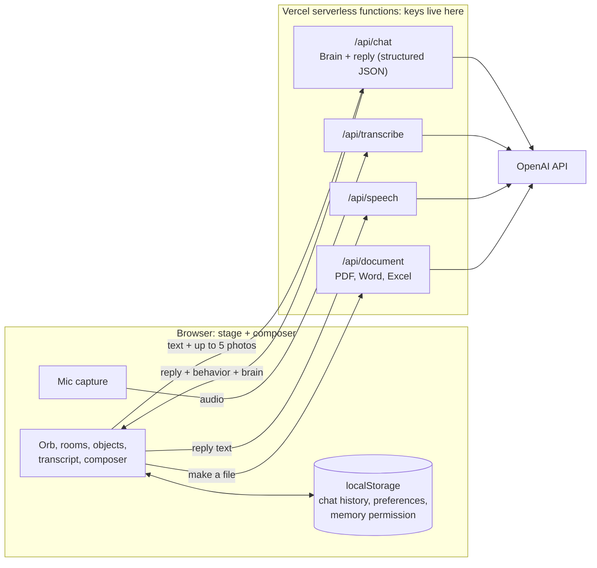

# Bluey

**An AI friend that helps everyday people get dramatically better results from AI, without ever making them learn prompt engineering.**

Bluey is a friendly blue 3D orb who lives in a small digital world. You talk to him the way you'd talk to a person. He works out what you are really trying to do, asks only the questions that would improve the result, does the work, and quietly shows you better ways to use AI along the way. Most people were never taught how to ask an AI for what they need. Bluey teaches without teaching.

> Built around one idea: **Say it naturally → Bluey finds the real goal → asks only what matters → does the work → you get a better result, and learn how without a lesson**

**Try it live:** https://bluey-ai-friend.vercel.app/  
**How it's built:** [Architecture](#high-level-architecture) · [Brain](#the-brain-do-discover-grow) · [Brain Lab](#brain-lab) · [Run it locally](#run-it-locally)

> **Demo note:** Bluey is an **alpha in active testing**. Open it on your phone and just start typing, or turn Voice on and talk. Chat history in this alpha is stored only in your current browser. Please don't share sensitive personal information, and expect rough edges.

## Why I built it

Many people don't think of themselves as "AI users." They don't know what to ask, how much context to give, or what AI could do for their everyday life and work. Traditional prompt training starts by teaching them the vocabulary first.

Bluey reverses that. The user says something ordinary. Bluey helps uncover the goal with a good question, offers possibilities the user hadn't considered, and improves the request through conversation. Over time the user gets better at working with AI almost without noticing.

Bluey is intentionally **not** a developer dashboard. He is meant for first-time AI users, older adults, hesitant users, professionals who know their job but not AI, and people who mostly use a phone.

## Screenshots

A clear request gets done (DO). A vague one gets one question first (DISCOVER).

<p>
  
  
</p>

## What Bluey does

- **Conversation first.** Type or talk in plain language. Text always works, and voice is optional.
- **Knows when to ask and when to just do it.** A simple request gets an answer, not an interview. A genuinely vague one gets one good question. See [the Brain](#the-brain-do-discover-grow).
- **Photos.** Add up to five photos, or paste a screenshot, and ask Bluey about what's in them.
- **Voice in and out.** Speech-to-text for talking to Bluey and generated speech for his replies, with Voice and Sounds toggles so users can silence him any time.
- **Creates files.** Bluey can prepare PDF, Word, and Excel documents from the conversation, including from attached photos.
- **A world, not a text box.** Bluey moves around a small stage and visits environments (Home, Library, Workshop, Archive, Observatory, Arcade, Quiet Place, and The Edge) with objects that invite questions.
- **Steer a draft with one tap.** Under a draft Bluey writes (a text, an email, a post, a plan) sit small buttons: **Shorter, Warmer, More specific, Different angle**, and a **More ▾** dropdown with More formal, More casual, Simpler words, Bullet points, For someone else…, and Something else…. Tapping one sends a plain message like "Make it shorter." in your own chat, so you see that a few ordinary words steer the result, and Bluey edits his draft instead of starting over, keeping every detail. Small talk and answers don't get the buttons.
- **Says what he guessed.** When a draft rests on a guess (who it's for, the tone), a quiet line under it says so, like "💭 I kept it warm and general, as if you're a guest giving the toast.", with a **Fix that** button that starts your correction.
- **Small first versions for big tasks.** Ask for a plan or a bigger project and Bluey gives you a short first version right away, then offers to build it out, instead of asking for a perfect brief.
- **Remembers what you choose, in this browser.** Say something lasting ("from now on, keep it short") and Bluey asks "Remember this for next time?". Nothing is saved unless you tap Remember. A **Remembered ▾** menu lists what's saved, with Forget and Forget all. Up to 8 preferences, kept only in this browser, sent with each message as style preferences.
- **A fun hello.** About 30 greetings in Bluey's voice (marbles, Pixel One, suspicious magnets), a few for Mondays, Fridays, and weekends, and a birthday one on July 7. It won't repeat any of your last 8.
- **Saves and shares.** New chat, Save chat, Copy a reply, and Play a reply again.
- **Honest by design.** Bluey is instructed never to claim a feature, memory, image, or file that doesn't exist. If an upload or API call fails, he says so.
- **Real requests always reach the brain.** Bluey has dozens of playful built-in replies (favorite color, his rooms, "thanks!"), matched by keyword. Those used to catch real requests too: a long message that mentioned "browser" got a canned speech about browsers, "my printer says offline" got a printer joke, and "please verify this" was never sent. Now any message that looks like a real request (more than 10 words, more than one sentence, or task words like *my, help, write, please, verify*) goes straight to the brain ([`brain-first.js`](brain-first.js)). Short playful messages keep their fun answers.

## The Brain: DO, DISCOVER, GROW

Behind every reply, a structured "brain" step decides how Bluey should behave. It is behavior logic, not visible buttons.

| Mode | When | What Bluey does |
| --- | --- | --- |
| **DO** | The request is clear enough | Does the work instead of interrogating the user |
| **DISCOVER** | Important information is genuinely missing | Asks the smallest number of high-value questions, in plain words ("Is this going to a customer, your boss, or a friend?") |
| **GROW** | The task can be finished, and there's a useful way to add value | Completes it, then shows the user a capability or a better way to ask |

The brain also tracks the user's current goal, detects when the topic genuinely changes (so an old goal doesn't hijack a new task), rates how ready the answer is, and picks an *initiative level* from simply answering up to proposing an improvement, only when the evidence supports it. The "Who / What / Where / When / Why / How" questions are used as a guide for what might be missing, never as a mandatory form.

## Brain Lab

The Brain is a product promise, so it is tested like one. [`brain-lab.html`](brain-lab.html) is a developer test page, with the test cases and scoring in [`brain-eval.js`](brain-eval.js) and the runner in [`brain-lab-v2.js`](brain-lab-v2.js). The app doesn't link to it.

> **Why the Brain Lab is turned off on the live site:** every test sends a real conversation to OpenAI, and a full run of the suite is 27 paid requests (39 on the beta branch). A public Run button would let anyone spend the project's API budget over and over. So [`vercel.json`](vercel.json) sends `/brain-lab.html` to the home page on any `.vercel.app` deployment, and the lab runs only on a developer's own machine. The test cases and the scoring are public in this repo, so anyone can read exactly what is tested.

To use it, [run Bluey locally](#run-it-locally) and open `/brain-lab.html`. Each run sends real requests to `/api/chat`, so it uses your OpenAI key.

- **27 regression conversations**, including multi-turn ones: a simple answer that should stay simple, clear writing tasks, a vague request, messy spelling, a recurring weekly workflow, a topic change that must not drag the old goal along, a "continue" turn, an emotional turn, and ordinary tasks that must not turn into business ideas.
- **Draft steering (6 of the 27):** a draft request is marked as a draft, a plain question and small talk are not, and after "Make it shorter." / "Make it warmer." / "Make it more formal." the revision must keep every fact from the previous draft (checked by pattern), with Shorter at most two-thirds of the original length.
- **Guesses, big tasks, and preferences (6 of the 27):** a vague draft ("Write a toast for the wedding.") states its guess and a fully specified one doesn't; a big task gets a short first version (at most one question, under 1,400 characters); "from now on, keep it short" is noticed as a lasting preference and "short answer this time" isn't; and a saved preference (always use bullet points) is followed.
- **Each reply is checked against expectations** for that case: the mode, how much initiative it took, how many questions it asked, whether it noticed a topic change, and how far up the opportunity ladder it went.
- **Each reply is scored** on task success, initiative fit, question discipline, goal fidelity, and "Blueyness". Generic help-desk phrasing ("As an AI…", "How can I assist") and replies that repeat an earlier answer's wording are flagged. A case passes with a score of 75 or more, every expectation met, and no repeated answer.
- **On the beta branch** ([`brain-lab-v23-real-human`](https://github.com/mrkygray-art/bluey-ai-friend/tree/brain-lab-v23-real-human)), the lab has grown to **39 permanent release-gate tests**: the 19-test V2.2 baseline plus 20 real-human scenarios for ambiguity, corrections, references, frustration, continuity, constraints, and changing minds. It also has 7 retrieval tests for the beta memory store.
- Brain changes went through hours of regression runs: run the suite, fix what failed, run it again. The app also has a world regression runner for traveling between rooms.

## Architecture

The browser holds the stage and the experience. Serverless functions hold every API key and make every model call.

### High-level architecture



The reply isn't only text. The server returns the reply together with a **behavior** (how Bluey should move or react) and the **brain** analysis, so the stage responds to the conversation instead of animating at random.

## Technology stack

| Layer | Technology |
| --- | --- |
| Front end | Plain HTML, CSS, and JavaScript, mobile-first |
| Backend | Vercel serverless functions (Node) |
| Chat and reasoning | OpenAI Responses API with strict JSON-schema output |
| Speech-to-text and text-to-speech | OpenAI audio models, behind `/api/transcribe` and `/api/speech` |
| File creation | `docx`, `pdfkit`, and `xlsx` |
| Local state | Browser `localStorage` |
| Hosting | Vercel |

## Memory: where it stands

Today, chat history and the preferences you choose to save live only in this browser (see **Remembers what you choose** above), and durable memory sits behind an explicit permission setting. Bluey is built never to claim he remembers something that was never stored.

Account sign-in, cross-device memory, and a semantic, user-controlled memory service (see what Bluey remembers, correct it, forget it) are the next planned stage. They are **not** in this alpha. A first version is in beta on the `brain-lab-v23-real-human` branch: a Supabase table where Bluey saves facts, retrieves only the relevant ones for a new message, and forgets on request (including after a project is renamed). It still uses a single test owner, so it waits on sign-in before it can go live.

## Safety, privacy, and limits

- API keys are server-side environment variables and never appear in the browser or in this repository (variable names only, in [`.env.example`](.env.example)).
- Requests are size-limited and photo and audio inputs are validated before they reach a model.
- Every endpoint that calls OpenAI has a per-visitor hourly limit and a daily cap ([`api/_limit.js`](api/_limit.js)). These are best-effort: they live in memory and reset when Vercel starts a new instance, so they stop casual abuse and runaway loops, not a determined attacker. The real backstop is a monthly spending limit on the OpenAI account.
- Bluey is a friendly companion, not a source of professional advice. This is an alpha: don't enter sensitive information.
- Bluey is an original character and is not affiliated with any television series or brand of the same name.

## Browser testing

Troubleshot by hand on desktop and Android across Chrome, Firefox, and DuckDuckGo: the mobile layout, tap-to-talk, the soft keyboard, pasting images, and room travel. Fixes include screen-height fallbacks for browsers without dynamic viewport units and a keyboard-send fallback when `form.requestSubmit()` is missing. On computers, the greeting used to sit at the top of the window, away from Bluey, and on phones it stayed in the middle when he drifted to one side. Now, on every screen, the greeting and status stay in a column just under Bluey and follow him as he drifts left and right and forward and back ([`follow-copy.js`](follow-copy.js)).

## Not measured yet

- iPhone and Safari (no regular access to an iPhone yet)
- Testing with people who aren't AI users, which is the real measure of "teaching without teaching"
- Long-term memory quality, because durable semantic memory isn't built yet
- Cost, load, and abuse behavior at scale

## Project status

Bluey is an actively developed alpha. Production **Alpha 47** is the frozen baseline, and Beta work on the Brain and relationship memory advances separately so the baseline stays stable.

## Run it locally

Needs Node and the [Vercel CLI](https://vercel.com/docs/cli). There is no build step.

```bash
npm install
cp .env.example .env     # then add your own OPENAI_API_KEY
vercel dev               # serves the app and the /api functions
```

| Setting | What it does |
| --- | --- |
| `OPENAI_API_KEY` | Required. Used only by the serverless functions |
| `BLUEY_MODEL` | Optional chat model override |
| `BLUEY_SPEECH_MODEL`, `BLUEY_SPEECH_VOICE` | Optional text-to-speech overrides |
| `BLUEY_TRANSCRIBE_MODEL` | Optional speech-to-text override |

## Repository notes

This repository is public. No secrets are committed. If you fork it, set your own `OPENAI_API_KEY` and put a spending limit on it.

---

**Designed and developed by Ky Gray**  
Security Solutions Engineer · AI/SaaS Product Builder

© 2026 Ky Gray. All rights reserved.
